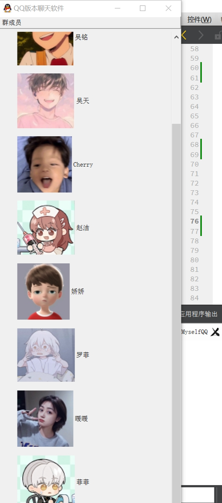
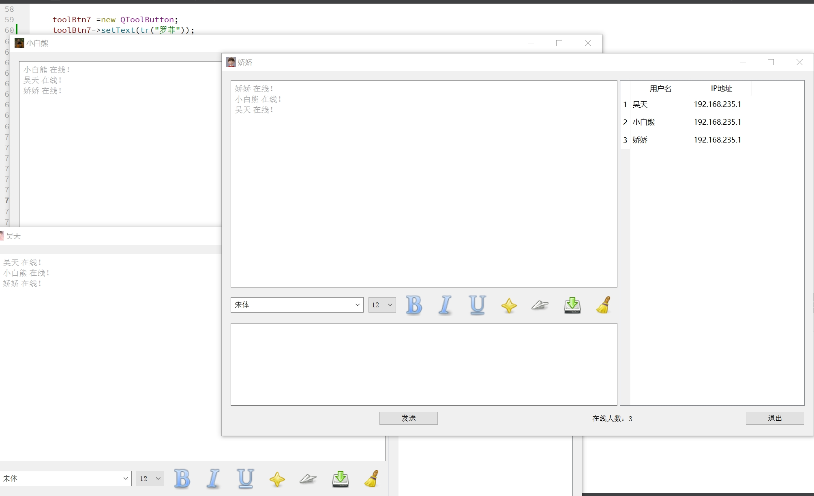
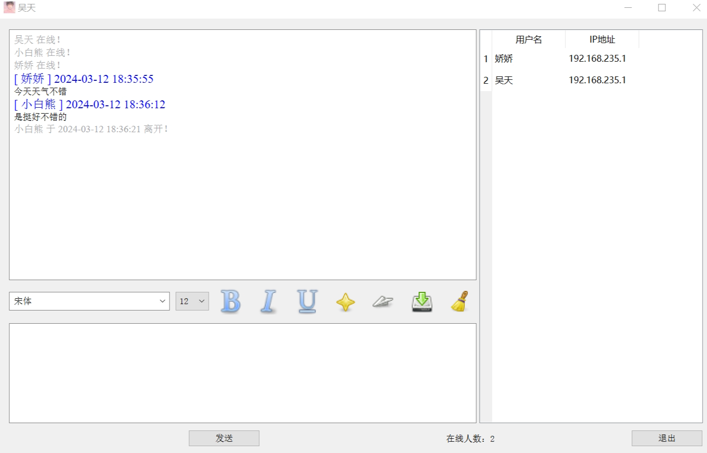
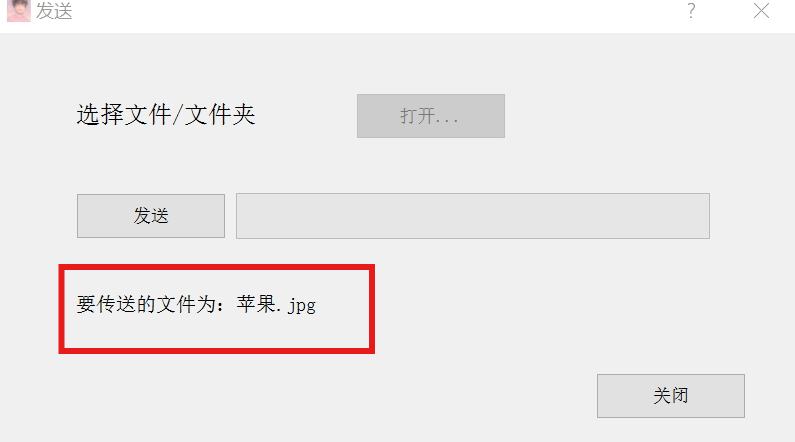
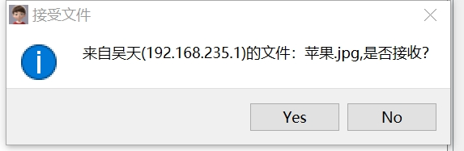
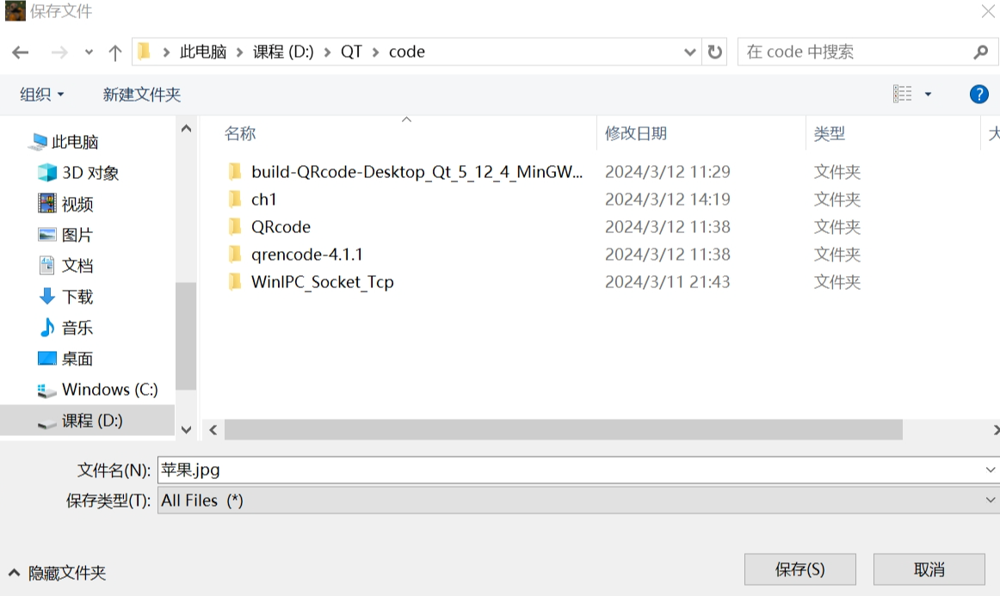
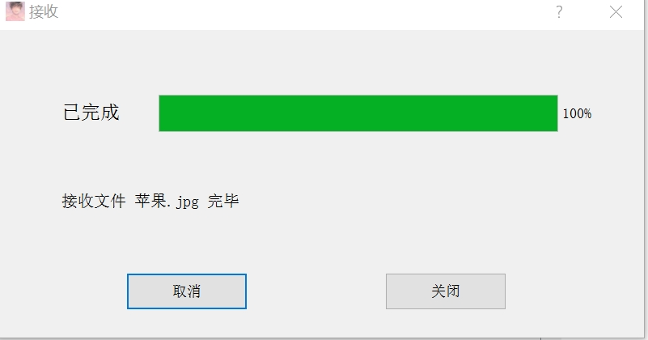
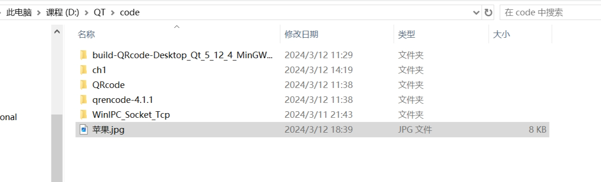
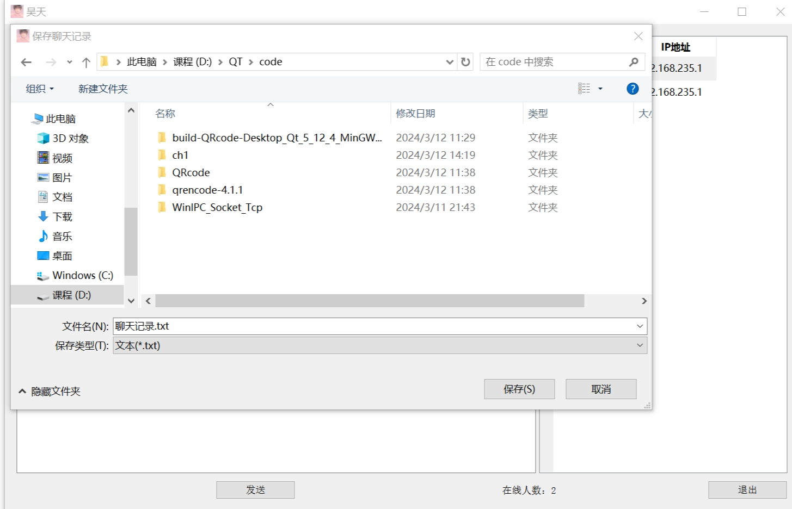
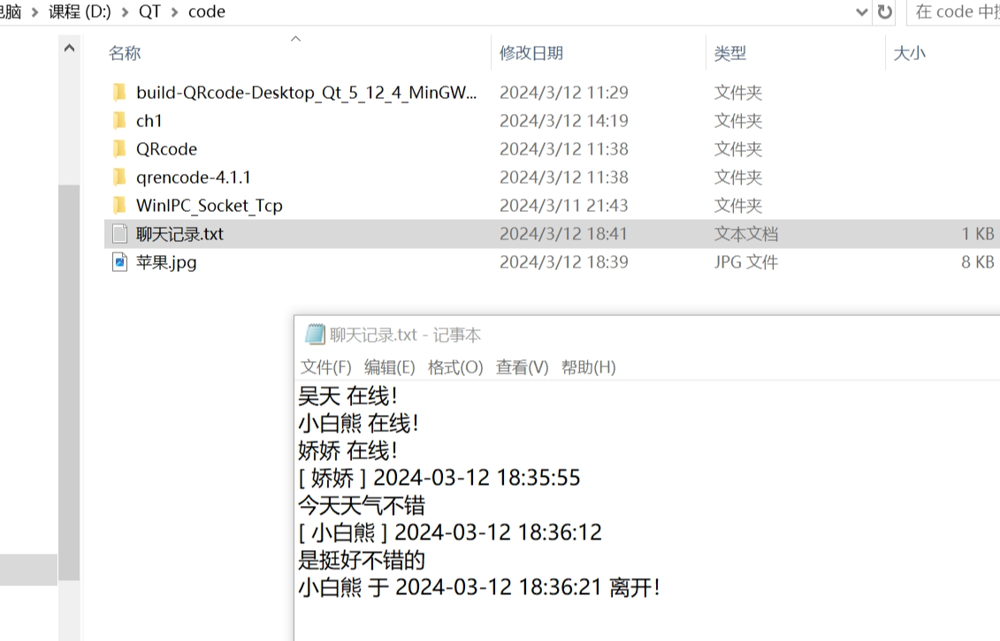

# 功能界面布局

主界面（QToolBox）、聊天窗口界面（QWidget）通过点击主界面的群成员的头像控制群成员聊天界面的弹出

# 聊天会话功能

使用UDP广播方式进行消息会话，将聊天信息实时地展示在聊天窗口界面上

# 文件传输功能

采用TCP和C/S方式来实现。选择要为其发送文件的用户，再点击传输文件按钮。此时会发送UDP广播，接收端如果拒绝接收使用UDP广播返回给发送端，服务关闭。如果同意才建立TCP连接进行数据传输

# 保存聊天记录

先获取要保存的文件名以此打开文件，如果成功打开，创建一个QTextStream对象将聊天记录写入文件

